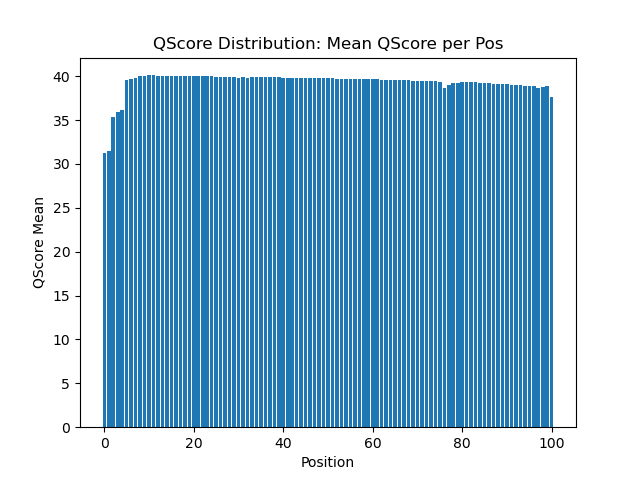
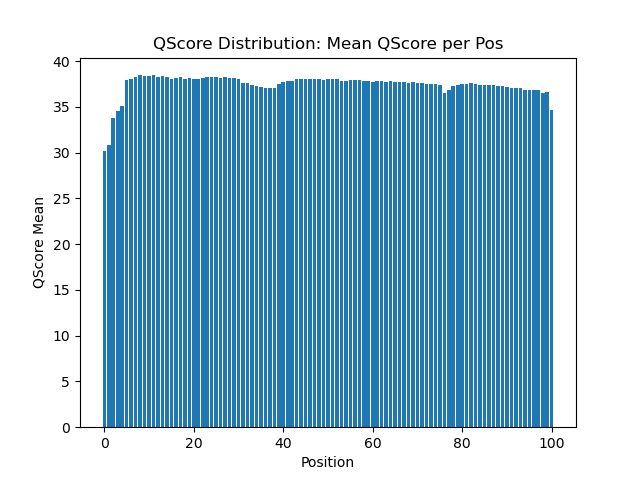

# Assignment the First

## Part 1
1. Be sure to upload your Python script.

| File name | label | Read length | Phred encoding |
|---|---|---|---|
| 1294_S1_L008_R1_001.fastq.gz | read 1 | 101 | Phred +33 |
| 1294_S1_L008_R2_001.fastq.gz | index 1 | 8 | Phred +33 |
| 1294_S1_L008_R3_001.fastq.gz | index 2 | 8 | Phred +33 |
| 1294_S1_L008_R4_001.fastq.gz | read 2 | 101 | Phred +33 |

2. Per-base NT distribution
    1. Use markdown to insert your 4 histograms here.
    
    Read 1 - QScore Distribution
    
    
    
    Index 1 - QScore Distribution
    
    
    
    Read 2 - QScore Distribution
    
    
    
    Index 2 - QScore Distribution
    
    

    2. Index reads should have a quality score cutoff of >30, meaning that the accuracy of each base call is >99.9% (expected every 1 in 1000 bases is an error). Biological reads should have a quality score cutoff of >20, meaning that the accuracy of each base call is >99% (expected every 1 in 100 bases is an error). The biological reads should be high accuracy if possible, but the indices essentially require the highest possible quality scores so that you can be sure that your datasets have separated (demultiplexed) accurately.

    3. Bash command Index 1=
    
        ``` $ zcat 1294_S1_L008_R2_001.fastq.gz | grep -A1 "^@" | grep -v "^@" | grep -v "^--" | grep "N" | wc -l ```
        
       Bash command Index 2 =
       
        ``` $ zcat 1294_S1_L008_R3_001.fastq.gz | grep -A1 "^@" | grep -v "^@" | grep -v "^--" | grep "N" | wc -l ```
        
       Outputs: Index 1 Command = 3976613, Index 2 Command = 3328051
       
       Sum of indicies containing "N" = 7304664.
    
## Part 2
1. Define the problem
2. Describe output
3. Upload your [4 input FASTQ files](../TEST-input_FASTQ) and your [>=6 expected output FASTQ files](../TEST-output_FASTQ).
4. Pseudocode
5. High level functions. For each function, be sure to include:
    1. Description/doc string
    2. Function headers (name and parameters)
    3. Test examples for individual functions
    4. Return statement
